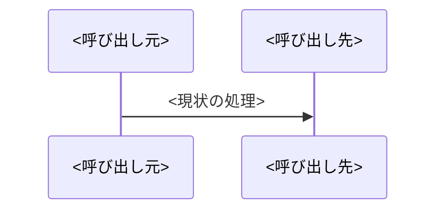

# Design: <タイトル>

## 具体的な仕様・設計

### 現状の問題
<!-- 必要に応じて Mermaid で現状のフローを図示する -->



### 解決方針
<!-- どう直すかの方針を1〜2段落で -->

### 設計詳細
<!-- 変更点ごとに、対象と実装内容をコード例で示す -->

#### 1. <変更点>

```
<実装コード例>
```

### 解決後のフロー
<!-- 必要に応じて Mermaid で解決後のフローを図示する -->

## 実装アプローチ

### 手順
1.
2.

### 変更するコンポーネント

| ファイル | 変更内容 |
|---|---|
| <path> | <変更内容> |

### データ構造の変更
<!-- DB / スキーマ / 型の変更。なければ「なし」と明記する -->
なし

### 影響範囲の分析
<!-- 影響が及ぶ範囲と、限定的である根拠 / リスク -->
-

## 動作確認対象
<!-- 対象ごとに具体的な確認手順を書く。確認方法は画面操作・CLI実行・APIコール・ログ確認など、対象に合わせる -->

### 1. <対象（画面 / コマンド / エンドポイントなど）>
- <入口（URL / 実行コマンドなど）> で <操作・実行> する
- <期待結果> を確認する
